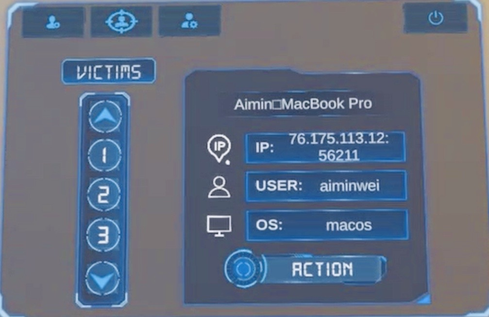
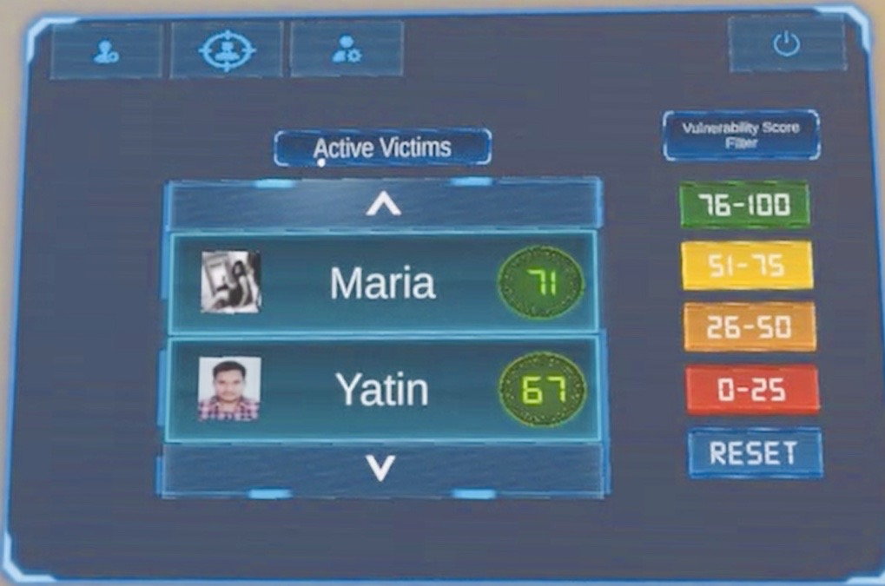
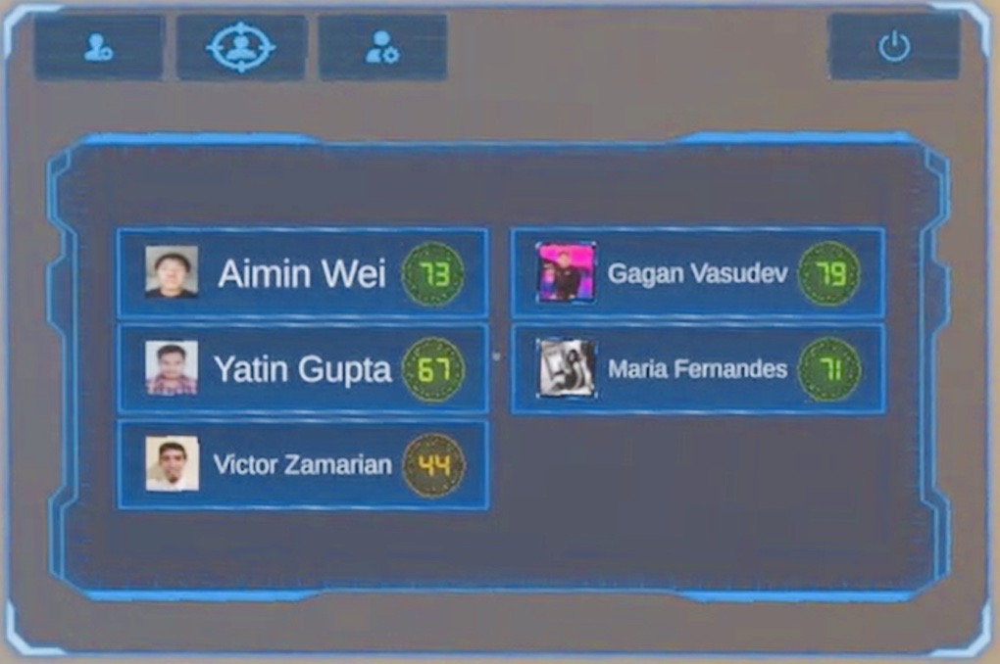
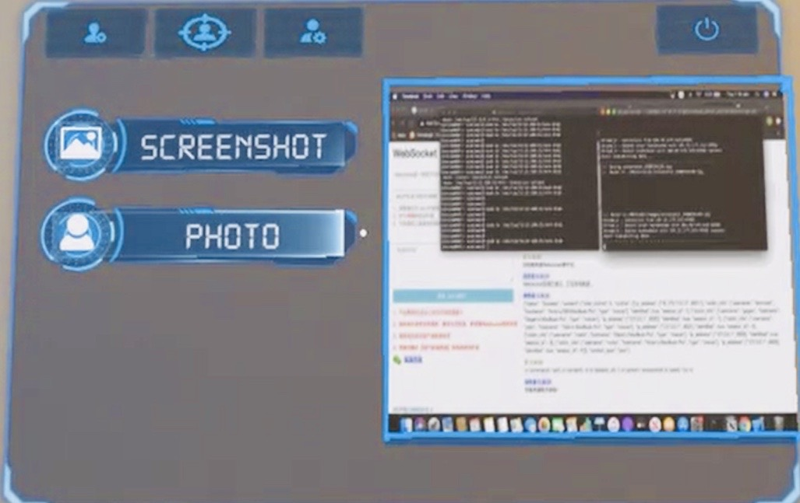
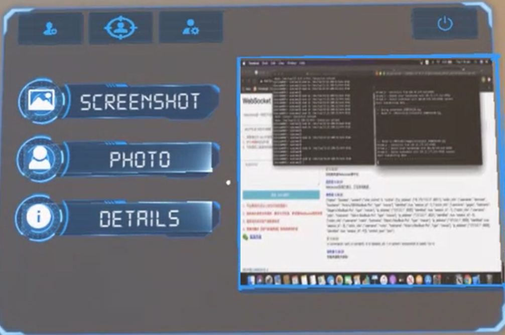
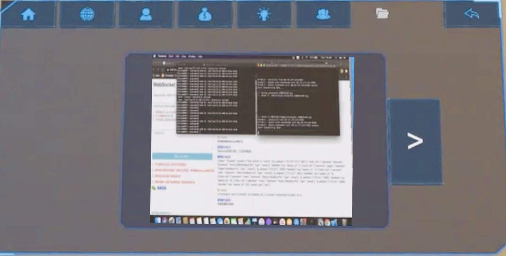

# GodsEye 2020

Today, the internet is a resource that is widely available and has become a very important part of our daily lives to the extent that we cannot imagine our day without it. There are things from work to entertainment for which we use the internet and publish information about us on it. The information we put up there can be very ordinary for us but we never know how it can be used by anyone for malicious
activities.

With this project, we want to demonstrate the attacker’s role in exploiting people’s privacy in different ways which can harm the general public in a very adverse manner.

In this project workflow, an attacker can fetch information about anyone by hacking their PCs and clicking a picture through it monitoring their device activity via the hololens.

# Scenario

In this scenario, the attacker will host an open wifi network at a public place which will appear to be a genuine free open wifi hotspot of that place. As soon as people connect to this wifi they will be redirected to a captive-login page where they will be asked to enter the username and password for accessing the internet and there will also be a link at the bottom which will suggest users to download the login credentials. If someone clicks on that link a file will be downloaded on their system and if the victim opens it a bash script will run in the background which will establish a TCP connection between that PC and the attacker’s server and in the GUI the login credentials will be displayed. 

Once the TCP connection is established between the victim’s PC and the attacker’s server, attacker can run a set of commands on the victim’s machine, one of the most important ones is to click the picture of the victim using its inbuilt webcam and then sending that file through the TCP connection to the server where the facial recognition API will identify the victim and fetch their information from different websites.

This method can be used to attack many people at a single instance of time without the need of attacker interacting with the victim in person. In this case, all the victims and their vulnerability scores will be displayed in a table format in the HoloLens and the attacker can choose to see information about any victim.

# Flow Diagram 

# Software Components

## Trojan

1. Establishes TCP connection to the attacker’s server in the background
2. Shows username and password to access the internet

## Hacker's Server

1. Runs a Nginx server on top of Egg shell.
2. Communicates with Azure for Facial Recognition.
3. Communicates with Hololens to send Victim’s Information
4. Deployed on AWS/Azure

## Azure Facial Recognition Service

1. Identifies a person and return its face id.
2. Deployed on Azure

## Hololens UI Design

HoloLens' MR capabilities is being used to implement this project as there’s a need to interact with the virtual and the real world at the same time.

This project’s UI has two parts: Control Panel UI and Informational UI.

1. Control Panel UI is a part involved in the security area. There are three tabs in the
Control Panel UI which include connected victims, identified victims, and history.
2. Informational UI presents the detailed information of victims in a tabbed view. There
are multiple sections of victims’ info, such as social media, personal, financial, history
of screenshots & images.

### Control Panel UI

#### All Victims Page

The Victim page displays all the active victims that are connected to the backend server. Users can scroll up and down to choose any victims to show basic machine information, such as IP address, port, username and machine type. From this page,
users can enter into the actions page through the action button in the basic info panel.

<figure style="text-align:center">
    
    <figcaption><b>Fig. 1 </b>All Victims' Page</figcaption>
</figure>

#### Identified Victims Page

Identified victims page displays all the identified victims, a vulnerability score is accompanied by each victim to notify how much vulnerable this victim is. Users can also use the vulnerability score filter to choose the victims meeting the attacker’s requirement.

<figure style="text-align:center">
    
    <figcaption><b>Fig. 2 </b>Identified Victims' Page</figcaption>
</figure>

#### History Page

History page displays all the victims that have once been identified by our server, by clicking on each victim button on this page, users will be taken into the Informational UI to show all the detailed information of the chosen victim.

<figure style="text-align:center">
    
    <figcaption><b>Fig. 3 </b>History Page</figcaption>
</figure>

#### Actions Page

Action page shows all the available actions that can be performed by users, there are three commands for now. They are screenshot, photo, details (goes to informational UI and displayed when hacker navigates to Action Page from Identifed Victims' Page) and identify. Photo action will take a photo of the victim using the victims’ machine webcam. Screenshot will take a screenshot. Identify action will be executed automatically with requesting the command of Identifying multiple times to the server to take multiple photos to use Azure Face Recognition API to identify this victim. During the Identifying phase, a loading component will be displayed.

<figure style="text-align:center">
    
    <figcaption><b>Fig. 4 </b>Action's Page when navigated from All Victims' Page (Tab 1)</figcaption>
</figure>
     
<figure style="text-align:center">
    
    <figcaption><b>Fig. 5 </b>Action's Page when navigated from Identified Vicitms' Page (Tab 2)</figcaption>
</figure>

#### Information Page

This page is accessed from the History tab of the Control Panel UI. It can also be accessed through the Actions Page.

<figure style="text-align:center">
    
    <figcaption><b>Fig. 6 </b>Information Page</figcaption>
</figure>

# Contributors
1. Aimin Wei
2. [Divij Bhatia](https://divijbhatia.in "Divij Bhatia")
3. Dipesh Chauhan
4. Ruchir Shah
5. Wenbin Li
